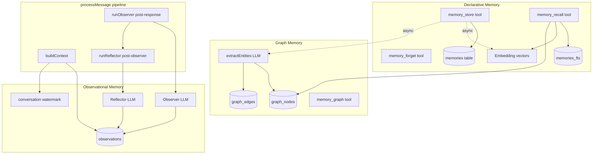
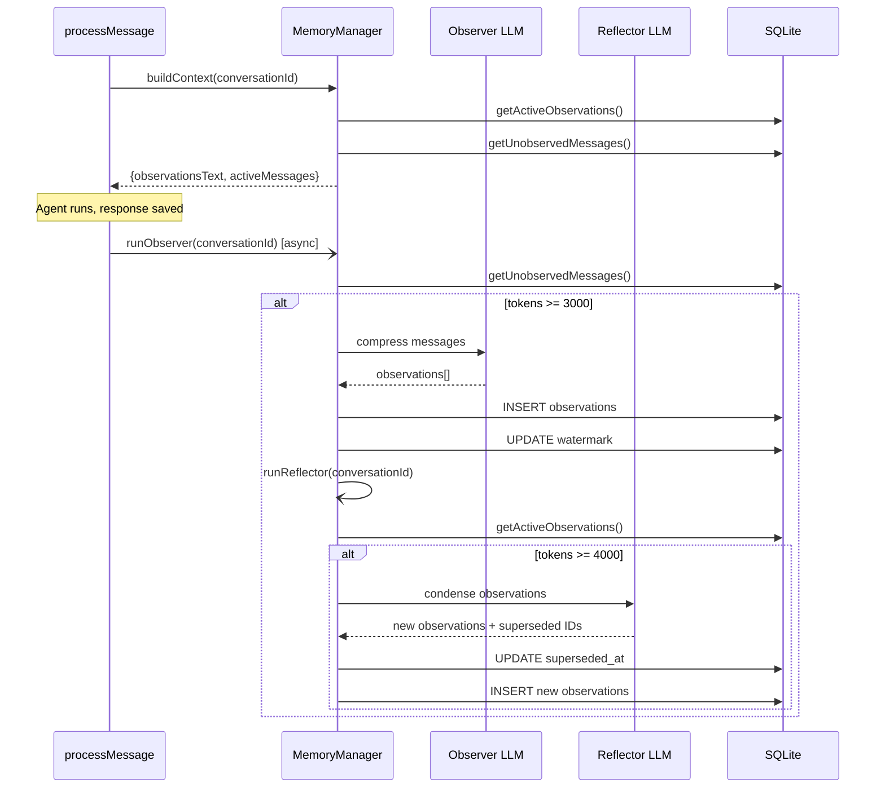

# Memory System

*Last updated: 2026-02-26 -- Initial documentation*

## Overview

Construct has a layered memory system that gives the agent both long-term factual recall and conversation-level context compression. The system consists of three cooperating subsystems:

1. **Declarative Memory** -- Explicit facts, preferences, and notes stored by the agent via tools. Searchable with FTS5, embedding similarity, and keyword fallback.
2. **Graph Memory** -- An entity-relationship graph extracted from stored memories by a worker LLM. Enables associative recall ("what do I know about Alice?" surfaces memories about Bob if Alice and Bob are connected).
3. **Observational Memory** -- Automatic compression of conversation history into dated observations. Replaces raw message replay with a compact prefix, keeping the context window lean as conversations grow.

Declarative memory is the foundation that existed before the recent additions. Graph memory and observational memory are new layers that build on top of it.

## Key Files

| File | Role |
|------|------|
| `src/memory/index.ts` | `MemoryManager` class -- facade for observational and graph memory |
| `src/memory/types.ts` | Shared type definitions (`Observation`, `GraphNode`, `GraphEdge`, `WorkerModelConfig`, etc.) |
| `src/memory/observer.ts` | Observer LLM call -- compresses messages into observations |
| `src/memory/reflector.ts` | Reflector LLM call -- condenses observations when they grow too large |
| `src/memory/context.ts` | `renderObservations()` and `buildContextWindow()` -- pure rendering functions |
| `src/memory/tokens.ts` | Token estimation utilities (chars/4 heuristic) |
| `src/memory/graph/index.ts` | `processMemoryForGraph()` -- orchestrates entity extraction and graph upsert |
| `src/memory/graph/extract.ts` | `extractEntities()` -- LLM call to extract entities and relationships |
| `src/memory/graph/queries.ts` | Graph database operations: node/edge CRUD, traversal, search |
| `src/tools/core/memory-store.ts` | `memory_store` tool -- stores memories, triggers embedding + graph extraction |
| `src/tools/core/memory-recall.ts` | `memory_recall` tool -- hybrid search with graph expansion |
| `src/tools/core/memory-forget.ts` | `memory_forget` tool -- soft-delete (archive) memories |
| `src/tools/core/memory-graph.ts` | `memory_graph` tool -- explore, search, and connect graph nodes |
| `src/db/queries.ts` | `storeMemory()`, `recallMemories()`, `updateMemoryEmbedding()`, etc. |
| `src/db/migrations/005-graph-memory.ts` | Creates `graph_nodes` and `graph_edges` tables |
| `src/db/migrations/006-observational-memory.ts` | Creates `observations` table, adds watermark columns to `conversations` |

## Architecture



## Declarative Memory

### Storage

When the agent calls `memory_store`, the tool:

1. Inserts a row into the `memories` table with a nanoid, content, category, tags, and source.
2. **Async (non-blocking)**: Generates an embedding vector via `generateEmbedding()` and stores it in the `embedding` column as JSON.
3. **Async (non-blocking)**: Passes the memory to `MemoryManager.processStoredMemory()` for graph extraction.

Categories: `general` (default), `preference`, `fact`, `reminder`, `note`.

### Recall

`memory_recall` performs a three-tier hybrid search via `recallMemories()` in `src/db/queries.ts`:

1. **FTS5 full-text search** -- Tokenizes the query into OR-joined terms and searches `memories_fts`. Results ranked by BM25.
2. **Embedding cosine similarity** -- Loads all non-archived memories with embeddings, computes cosine similarity against the query embedding, and keeps results above the threshold (default 0.3).
3. **LIKE keyword fallback** -- If still below the limit, does `LIKE '%keyword%'` on content and tags.

Results are merged and deduplicated by ID across all three tiers. Each result carries a `matchType` (`fts5`, `embedding`, or `keyword`).

After the direct search, `memory_recall` also **expands via graph traversal**: it searches `graph_nodes` for matching node names, traverses up to 2 hops from each match, collects all connected `memory_id` values from edges, and appends those memories (tagged `[graph]`) to the result set.

### Forgetting

`memory_forget` performs a soft delete by setting `archived_at` on the memory row. Archived memories are excluded from all search results. The tool supports both direct ID-based archival and query-based candidate search.

## Graph Memory

Graph memory builds a knowledge graph of entities and relationships extracted from stored memories. It enables associative recall -- finding memories that are semantically related through shared entities rather than just keyword or embedding overlap.

### Schema

**`graph_nodes`** -- Entities extracted from memories.

| Column | Type | Notes |
|--------|------|-------|
| `id` | text (PK) | nanoid |
| `name` | text | Canonical (lowercased, trimmed) |
| `display_name` | text | Original casing |
| `node_type` | text | `person`, `place`, `concept`, `event`, or `entity`. Default `entity` |
| `description` | text (nullable) | Short description from extraction |
| `embedding` | text (nullable) | Reserved for future node embeddings |
| `created_at` | text | Auto-set |
| `updated_at` | text | Auto-set |

Unique index on `(name, node_type)` -- same canonical name can exist as different types (e.g., "Java" as both concept and place).

**`graph_edges`** -- Relationships between nodes.

| Column | Type | Notes |
|--------|------|-------|
| `id` | text (PK) | nanoid |
| `source_id` | text (FK) | References `graph_nodes.id` |
| `target_id` | text (FK) | References `graph_nodes.id` |
| `relation` | text | Short verb phrase, lowercased (e.g., `lives in`, `works at`) |
| `weight` | real | Default 1.0, incremented on repeated mention |
| `properties` | text (nullable) | JSON for extensible metadata |
| `memory_id` | text (nullable, FK) | References `memories.id` -- links edge back to source memory |
| `created_at` | text | Auto-set |
| `updated_at` | text | Auto-set |

Unique index on `(source_id, target_id, relation)` -- duplicate edges increment `weight` instead of creating new rows.

### Extraction Pipeline

When a memory is stored, `MemoryManager.processStoredMemory()` fires asynchronously:

1. **`extractEntities()`** (`src/memory/graph/extract.ts`) sends the memory content to the worker LLM with a structured extraction prompt.
2. The LLM returns JSON with `entities` (name, type, description) and `relationships` (from, to, relation).
3. **`processMemoryForGraph()`** (`src/memory/graph/index.ts`) iterates over the extracted data:
   - Each entity is upserted as a node (matched by canonical name + type). Descriptions are only filled in if the existing node has none.
   - Each relationship is upserted as an edge. If the edge already exists (same source, target, relation), its `weight` is incremented. The originating `memory_id` is stored on the edge.
   - If a relationship references an entity not in the current extraction, the system looks for it in the existing graph or creates a new `entity`-typed node.
4. Usage (input/output tokens) is tracked in `ai_usage` with source `graph_extract`.

### Graph Queries

`src/memory/graph/queries.ts` provides:

- **`upsertNode(db, {name, type, description})`** -- Case-insensitive dedup by `(name, node_type)`. Fills in description if the existing node lacks one.
- **`findNodeByName(db, name, type?)`** -- Case-insensitive exact match. Optional type filter.
- **`searchNodes(db, query, limit)`** -- `LIKE '%query%'` on canonical name. Returns up to `limit` results ordered by `updated_at` desc.
- **`upsertEdge(db, {source_id, target_id, relation, memory_id})`** -- Dedup by `(source_id, target_id, relation)`. Increments `weight` on duplicates.
- **`getNodeEdges(db, nodeId)`** -- Returns all edges where the node is source or target, ordered by weight descending.
- **`traverseGraph(db, startNodeId, maxDepth)`** -- Recursive CTE traversal. Returns all reachable nodes within `maxDepth` hops with depth and `via_relation`. Handles cycles via a visited-node string.
- **`getRelatedMemoryIds(db, nodeIds)`** -- Returns distinct `memory_id` values from edges connected to any of the given nodes.
- **`getMemoryNodes(db, memoryId)`** -- Returns all graph nodes connected to a specific memory via edges.

### memory_graph Tool

The `memory_graph` tool (`src/tools/core/memory-graph.ts`) exposes the graph to the agent with three actions:

- **`search`** -- Find nodes by name pattern. Returns display names, types, and descriptions.
- **`explore`** -- From a specific node, show direct connections (edges with directions and weights) and reachable nodes up to `depth` hops (default 2, max 3).
- **`connect`** -- Check if two named concepts are connected within `depth` hops. Returns the path depth and relation if found.

## Observational Memory

Observational memory solves the growing context window problem. Instead of replaying all past messages in a conversation, the system compresses older messages into concise, dated observations. The LLM then sees a stable observation prefix plus only the most recent un-observed messages.

### Schema

**`observations`** -- Compressed conversation summaries.

| Column | Type | Notes |
|--------|------|-------|
| `id` | text (PK) | nanoid |
| `conversation_id` | text (FK) | References `conversations.id` |
| `content` | text | The observation text |
| `priority` | text | `high`, `medium`, or `low`. Default `medium` |
| `observation_date` | text | Date context for the observation |
| `source_message_ids` | text (nullable) | JSON array of message IDs that produced this observation |
| `token_count` | integer (nullable) | Estimated token count of the content |
| `generation` | integer | 0 = produced by observer, 1+ = produced by reflector rounds. Default 0 |
| `superseded_at` | text (nullable) | Set when a reflector round replaces this observation |
| `created_at` | text | Auto-set |

Indexes: `idx_obs_conv` (conversation_id), `idx_obs_active` (conversation_id, superseded_at).

**Columns added to `conversations`** (migration 006):

| Column | Type | Notes |
|--------|------|-------|
| `observed_up_to_message_id` | text (nullable) | Watermark -- all messages up to and including this ID have been observed |
| `observation_token_count` | integer | Running total of active observation tokens. Default 0 |

### Observer

The observer (`src/memory/observer.ts`) compresses un-observed messages into observations.

**Trigger**: Called asynchronously after every `processMessage()` response. Only runs if un-observed messages exceed `OBSERVER_THRESHOLD` (3000 estimated tokens).

**Process**:
1. `MemoryManager.getUnobservedMessages()` loads messages after the watermark. Uses `rowid` comparison to handle messages inserted within the same second.
2. Messages are formatted as `[timestamp] role: content` and sent to the worker LLM with the observer system prompt.
3. The LLM returns JSON observations, each with `content`, `priority`, and `observation_date`.
4. Observations are validated (content must be a non-empty string, priority must be `low`/`medium`/`high`) and stored.
5. The watermark (`observed_up_to_message_id`) is advanced to the last processed message ID.
6. `observation_token_count` is updated with the cumulative token estimate.
7. Usage is tracked in `ai_usage` with source `observer`.

**Observer prompt rules**:
- Extract key information as self-contained bullet points
- Assign priority: `high` (decisions, commitments, important facts), `medium` (general context), `low` (small talk)
- Preserve concrete details: names, numbers, dates, preferences
- Omit pleasantries and filler
- Use present tense for ongoing states, past tense for events

### Reflector

The reflector (`src/memory/reflector.ts`) condenses observations when they accumulate too many tokens.

**Trigger**: Called automatically after the observer runs. Only runs if active (non-superseded) observations exceed `REFLECTOR_THRESHOLD` (4000 estimated tokens).

**Process**:
1. Active observations are loaded and formatted as `[id] (priority, date) content`.
2. Sent to the worker LLM with the reflector system prompt.
3. The LLM returns new condensed observations and a list of `superseded_ids` to retire.
4. Superseded observations have their `superseded_at` set (soft delete). The returned IDs are validated against the input set to prevent hallucinated IDs.
5. New observations are inserted with `generation = max(input generations) + 1`.
6. `observation_token_count` is recalculated from the new active observation set.
7. Usage is tracked in `ai_usage` with source `reflector`.

**Reflector prompt rules**:
- Combine related observations into richer single observations
- Remove superseded information
- Preserve high-priority items
- Drop low-priority items that add no lasting value
- Keep each observation self-contained

### Context Building

`MemoryManager.buildContext()` assembles the conversation context:

1. Loads active (non-superseded) observations for the conversation.
2. Loads un-observed messages (messages after the watermark).
3. Returns:
   - `observationsText` -- Rendered observations, or empty string if none
   - `activeMessages` -- The un-observed messages for replay
   - `hasObservations` -- Whether any observations exist

`renderObservations()` (`src/memory/context.ts`) formats observations with priority-based prefixes:
- `!` for high priority
- `-` for medium priority
- `~` for low priority

Example output:
```
! [2024-01-15] User has a dentist appointment on March 5th at 9am
- [2024-01-15] User is working on a TypeScript project called Construct
~ [2024-01-14] User mentioned they had coffee this morning
```

### Token Estimation

`src/memory/tokens.ts` uses a `chars / 4` heuristic for token estimation, plus 4 tokens of overhead per message (for role delimiters). This is intentionally simple and designed to be swappable with a real tokenizer later.

## Integration into processMessage()

The memory system integrates into the agent pipeline (`src/agent.ts`) at multiple points:

### At Message Arrival

1. **MemoryManager instantiation** (step 2): A `MemoryManager` is created with the database and worker model config. The worker model is configured via `MEMORY_WORKER_MODEL` env var. If not set, worker config is `null` and all LLM-powered memory features (graph extraction, observer, reflector) are disabled.

2. **Context building** (step 3): `memoryManager.buildContext()` determines what the LLM sees:
   - **If observations exist**: The LLM sees the rendered observations as a prefix (injected into the context preamble under `[Conversation observations]`) plus only the un-observed messages replayed as conversation turns. This keeps the context window bounded.
   - **If no observations yet**: Falls back to the last 20 raw messages (original behavior).

3. **Declarative memory loading** (step 4): Recent and semantically relevant memories are loaded independently and injected into the context preamble.

4. **Tool context** (step 8): The `memoryManager` instance is passed into the tool context, making it available to `memory_store` for triggering graph extraction.

### After Response

5. **Observer + Reflector** (step 15): After the response is saved, `memoryManager.runObserver()` is called with fire-and-forget semantics (`.then()/.catch()`, non-blocking). If the observer runs and creates observations, it chains into `memoryManager.runReflector()` to check if condensation is needed.



## Memory-Related Tools

All four memory tools are in the `core` pack (always loaded):

| Tool | Description |
|------|-------------|
| `memory_store` | Store a memory with content, category, and tags. Triggers async embedding generation and graph extraction. |
| `memory_recall` | Hybrid search (FTS5 + embedding + LIKE) with graph-based expansion. Returns results with match type and score. |
| `memory_forget` | Soft-delete by ID, or search for candidates first by query. |
| `memory_graph` | Explore the knowledge graph: `search` nodes, `explore` connections from a node, or `connect` two concepts. |

## Embeddings and Semantic Search

Embeddings are generated via OpenRouter's embeddings API (`src/embeddings.ts`). The default model is `qwen/qwen3-embedding-4b`, configurable via the `EMBEDDING_MODEL` env var.

Embeddings serve three purposes in the memory system:

1. **Memory recall** -- Query embedding is compared against stored memory embeddings for semantic search (cosine similarity threshold 0.4 in `processMessage()`, 0.3 in `recallMemories()`).
2. **Tool pack selection** -- The same query embedding is reused to select which tool packs to load.
3. **Skill selection** -- Also reused for selecting relevant extension skills.

Embedding generation for stored memories is non-blocking (fire-and-forget after `memory_store`). If embedding generation fails, the system degrades gracefully: semantic search returns no results, but FTS5 and keyword search still work.

## Configuration

| Variable | Required | Default | Description |
|----------|----------|---------|-------------|
| `MEMORY_WORKER_MODEL` | No | *(none)* | OpenRouter model ID for graph extraction, observer, and reflector LLM calls. If not set, all LLM-powered memory features are disabled and only declarative memory with embeddings works. |
| `EMBEDDING_MODEL` | No | `qwen/qwen3-embedding-4b` | OpenRouter model for generating embedding vectors. |
| `OPENROUTER_API_KEY` | Yes | -- | Used for all OpenRouter API calls including embeddings and worker model. |

The worker model is used for three separate LLM calls:
- **Graph extraction** (`graph_extract`) -- Extracts entities and relationships from stored memories
- **Observer** (`observer`) -- Compresses un-observed messages into observations
- **Reflector** (`reflector`) -- Condenses accumulated observations

All three track their usage in `ai_usage` with distinct `source` values (shown in parentheses above).

## Token Thresholds

| Constant | Value | Location | Purpose |
|----------|-------|----------|---------|
| `OBSERVER_THRESHOLD` | 3000 tokens | `src/memory/index.ts` | Minimum un-observed message tokens before observer triggers |
| `REFLECTOR_THRESHOLD` | 4000 tokens | `src/memory/index.ts` | Minimum active observation tokens before reflector triggers |

These use the chars/4 heuristic, so 3000 tokens is roughly 12,000 characters of message content.

## Architecture Decisions

### Why a separate worker model?

The main agent model (configured via `OPENROUTER_MODEL`) is optimized for conversation. Memory extraction and observation compression are background tasks that can use a cheaper, smaller model. Keeping them separate also means the worker model can be swapped or disabled independently without affecting the agent's conversational ability.

### Why token-based thresholds instead of message counts?

Message count is a poor proxy for context usage. A conversation with many short messages ("ok", "thanks") should not trigger compression at the same rate as one with long, information-dense messages. Token estimation, even via a simple heuristic, better captures actual context pressure.

### Why fire-and-forget for observer/reflector?

The observer and reflector run after the current response is already sent. Their output benefits the *next* turn, not the current one. Making them blocking would add latency to every response for no user-visible benefit.

### Why soft-delete for observations?

`superseded_at` rather than `DELETE` preserves the observation history. This enables debugging ("what did the reflector replace?") and potential future features like observation undo or audit trails.

### Why graph edges store memory_id?

Linking edges back to their source memory enables bidirectional traversal: from a graph query, the system can surface the original memories that established a relationship, providing concrete evidence rather than just abstract graph connections.

## Related Documentation

- [Agent System](./agent.md) -- How `processMessage()` orchestrates the full pipeline
- [Database Layer](./database.md) -- Schema details for all tables including `memories`, `graph_nodes`, `graph_edges`, `observations`
- [Tool System](./tools.md) -- Tool pack organization and embedding-based selection
- [System Prompt](./system-prompt.md) -- How observations and memories are injected into the context preamble
- [Environment Configuration](./../guides/environment.md) -- All environment variables including `MEMORY_WORKER_MODEL` and `EMBEDDING_MODEL`
