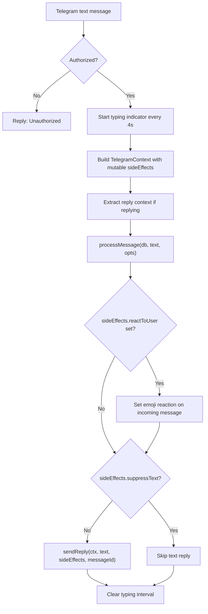

# Telegram Integration

*Last updated: 2026-02-24 -- Initial documentation*

## Overview

Telegram is the primary user-facing interface for Construct. The bot uses Grammy (a Telegram Bot API framework) with long polling to receive messages and reactions. It handles authorization, typing indicators, Markdown-to-HTML conversion, message chunking, reply threading, and reaction side-effects.

## Key Files

| File | Role |
|------|------|
| `src/telegram/bot.ts` | Bot creation, message/reaction handlers, markdown conversion, reply logic |
| `src/telegram/index.ts` | Standalone Telegram-only entry point (runs bot without scheduler) |
| `src/telegram/types.ts` | `TelegramContext` and `TelegramSideEffects` interfaces |

## Bot Setup

`createBot(db)` in `src/telegram/bot.ts` creates a Grammy `Bot` instance with the token from `env.TELEGRAM_BOT_TOKEN`.

The bot listens for two event types:
- `message:text` -- Text messages from users
- `message_reaction` -- Emoji reactions on messages

A catch-all `message` handler replies "I can only process text messages for now." for non-text messages (photos, stickers, etc.).

## Authorization

Authorization is controlled by `ALLOWED_TELEGRAM_IDS` (comma-separated list of numeric Telegram user IDs). If the list is empty, all users are allowed. Otherwise, only listed user IDs can interact.

Unauthorized users receive a simple "Unauthorized." reply. Unauthorized reactions are silently ignored.

## Message Handling Flow



### Typing Indicator

A "typing" chat action is sent immediately and then refreshed every 4 seconds (Telegram expires typing indicators after ~5 seconds). The interval is cleared in a `finally` block regardless of success or failure.

### TelegramContext

Each message creates a `TelegramContext` passed to `processMessage()`:

```typescript
interface TelegramContext {
  bot: Bot                       // Grammy bot instance
  chatId: string                 // Telegram chat ID
  incomingMessageId: number      // Message ID of the user's message
  sideEffects: TelegramSideEffects  // Mutable object for tool side-effects
}
```

### Side-Effects

Tools can set flags on `sideEffects` during execution:

```typescript
interface TelegramSideEffects {
  reactToUser?: string           // Emoji to react with
  replyToMessageId?: number      // Message ID for reply threading
  suppressText?: boolean         // If true, skip the text reply
}
```

After the agent finishes:
1. If `reactToUser` is set, the bot calls `setMessageReaction()` on the incoming message
2. If `suppressText` is false (default) and the response has text, `sendReply()` sends it

### Reply Context

When a user replies to a specific message in Telegram, the original message text is extracted from `ctx.message.reply_to_message.text` and passed as `replyContext`. This is included in the context preamble so the agent knows what is being referenced.

## Reaction Handling

When a user reacts to a message with an emoji:

1. The bot looks up which conversation the reacted message belongs to
2. It queries the database for the message by its Telegram message ID
3. A synthetic message is constructed: `[User reacted with <emoji> to <whose> message: "<preview>"]`
4. This synthetic message is processed through `processMessage()` like a normal message
5. The agent may respond with text, a reaction, or nothing

This allows the agent to interpret reactions contextually (e.g., a thumbs-up on a suggestion).

## Markdown to Telegram HTML

`markdownToTelegramHtml()` converts the agent's Markdown response to Telegram-compatible HTML:

1. **Protect code**: Extract code blocks (``` ```) and inline code (`` ` ``) to prevent processing
2. **Escape HTML entities**: `&`, `<`, `>` in remaining text
3. **Convert headers**: `# Heading` to `<b>Heading</b>`
4. **Convert formatting**: `***bold-italic***`, `**bold**`, `*italic*`
5. **Convert bullets**: `*` and `-` list items to `bullet` characters
6. **Restore code**: Re-insert code as `<pre>` and `<code>` with HTML escaping

If HTML parsing fails when sending, the bot falls back to sending plain text.

## Message Chunking

Telegram has a 4096-character message limit. The `sendReply()` function chunks long responses:

- Messages <= 4000 characters are sent as-is (with some margin)
- Longer messages are split into 4000-character chunks
- Only the first chunk uses `reply_parameters` for threading

## Telegram Message ID Tracking

After sending a reply, the bot stores the Telegram message ID of the sent message in the database via `updateTelegramMessageId()`. This enables:
- Future `telegram_reply_to` calls referencing the bot's own messages
- Reaction handling on the bot's messages (to determine `whose` in the synthetic reaction message)

Message IDs appear as `[tg:12345]` prefixes in conversation history replay.

## Standalone Telegram Mode

`src/telegram/index.ts` provides a lightweight entry point that runs only the Telegram bot without the scheduler. This is used by `npm run telegram`. It runs migrations, creates the database, and starts long polling.

## Error Handling

- Grammy errors are caught by `bot.catch()` and logged
- Individual message processing errors reply with "Something went wrong. Check the logs."
- Reaction processing errors are logged but do not send error messages to the user

## Related Documentation

- [Agent System](./agent.md) -- How messages are processed by the agent
- [Tool System](./tools.md) -- Telegram tools (react, reply-to, pin/unpin)
- [Scheduler](./scheduler.md) -- Sends scheduled messages through the bot
