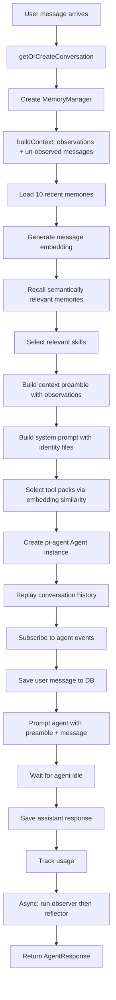

# Agent System

## Overview

The agent system is the central intelligence of Construct. It takes a user message, enriches it with context (memories, skills, history), selects appropriate tools, runs the LLM, and returns a response. Everything flows through a single function: `processMessage()` in `src/agent.ts`.

## Key Files

| File                      | Role                                                                                 |
| ------------------------- | ------------------------------------------------------------------------------------ |
| `src/agent.ts`            | `processMessage()` -- the main orchestration function                                |
| `src/system-prompt.ts`    | System prompt construction and context preamble                                      |
| `src/memory.ts`           | `ConstructMemoryManager` -- Construct-specific memory facade (extends `@repo/cairn`) |
| `src/tools/packs.ts`      | Tool pack selection and instantiation                                                |
| `src/extensions/index.ts` | Extension registry (skills, dynamic tools, identity)                                 |

Embeddings (`generateEmbedding`, `cosineSimilarity`) are provided by `@repo/cairn`. The core `MemoryManager` class also lives in `@repo/cairn` -- Construct subclasses it as `ConstructMemoryManager` in `src/memory.ts`.

## How processMessage() Works

The function signature:

```typescript
async function processMessage(
  db: Kysely<Database>,
  message: string,
  opts: ProcessMessageOpts,
): Promise<AgentResponse>;
```

`ProcessMessageOpts` includes:

- `source`: `'telegram'` or `'cli'`
- `externalId`: The chat or session identifier (e.g., Telegram chat ID)
- `chatId`: Telegram chat ID (used for tool context)
- `telegram`: Optional `TelegramContext` with bot instance and side-effects object
- `replyContext`: Text of the message being replied to (if any)
- `incomingTelegramMessageId`: Telegram message ID for the incoming message

### Step-by-Step Flow



### 1. Conversation Management

Every message is associated with a conversation identified by `(source, externalId)`. For Telegram, the external ID is the chat ID. For CLI, it is the fixed string `'cli'`. The function `getOrCreateConversation()` either finds an existing conversation or creates a new one.

### 2. MemoryManager and Context Building

A `ConstructMemoryManager` (subclass of Cairn's `MemoryManager`) is instantiated for the conversation with custom observer/reflector prompts and `expires_at` support. It uses the `MEMORY_WORKER_MODEL` env var to configure the worker LLM (if not set, LLM-powered memory features are disabled).

`memoryManager.buildContext()` determines what conversation history the LLM sees:

- **If observations exist**: Rendered observations become a stable text prefix (injected into the context preamble), and only un-observed messages (those after the watermark) are replayed as conversation turns. This keeps the context window bounded as conversations grow.
- **If no observations yet**: Falls back to loading the last 20 raw messages (original behavior).

See [Memory System](/construct/memory/) for details on how observations are created and managed.

### 3. Memory Context

Two types of memories are injected:

- **Recent memories** (10 most recent, regardless of relevance) -- for temporal continuity
- **Relevant memories** (up to 5, filtered by embedding cosine similarity >= 0.4) -- for semantic relevance

Relevant memories that already appear in the recent set are deduplicated.

### 4. Embedding Generation

The user's message is embedded using `generateEmbedding()` from `@repo/cairn`. This calls the OpenRouter embeddings endpoint with the configured `EMBEDDING_MODEL` (default `qwen/qwen3-embedding-4b`). The resulting vector is reused for:

- Memory recall (semantic search)
- Skill selection
- Tool pack selection

If embedding generation fails, graceful fallbacks kick in (all packs load, no semantic memory recall).

### 5. Skill Selection

Skills from the extension system are selected based on embedding similarity to the user's message. Up to 3 skills with similarity >= 0.35 are included. Selected skills are injected into the context preamble.

### 6. Context Preamble

The `buildContextPreamble()` function in `src/system-prompt.ts` creates a text block prepended to the user's message. It contains:

```
[Context: Monday, February 24, 2026 at 3:15 PM (America/New_York) | telegram]

[Recent memories -- use these for context, pattern recognition, and continuity]
- (preference) User prefers dark mode
- (fact) User works at Acme Corp

[Potentially relevant memories]
- (note) Meeting with Bob about the API redesign (87% match)

[Active skills -- follow these instructions when relevant]
### daily-standup
...skill instructions...

[Replying to: "what was that thing you mentioned yesterday?"]
```

### 7. System Prompt

The system prompt is built by `getSystemPrompt()` in `src/system-prompt.ts`. It concatenates:

1. `BASE_SYSTEM_PROMPT` -- Static rules about behavior, tool usage, Telegram interaction
2. Identity section from `IDENTITY.md` (if loaded)
3. User section from `USER.md` (if loaded)
4. Soul section from `SOUL.md` (if loaded)

The result is cached and invalidated when identity files change.

### 8. Tool Selection and Registration

Tool packs are selected based on embedding similarity (see [Tool System](/construct/tools/)). The selected packs are instantiated with a `ToolContext` that provides database access, API keys, project paths, and Telegram context. Each `InternalTool` is wrapped by `createPiTool()` to match the pi-agent-core `AgentTool` interface.

### 9. Agent Execution

A `pi-agent-core` `Agent` is instantiated with the system prompt and model. Conversation history is replayed via `agent.appendMessage()`. The agent subscribes to events for:

- `message_update` -- Accumulates response text from `text_delta` events
- `message_end` -- Captures usage statistics
- `tool_execution_end` -- Records tool call names and results

The agent is then prompted with `preamble + message` and the function awaits `agent.waitForIdle()`.

### 10. Persistence and Post-Response Memory

After the agent finishes:

- The user's message is saved (already done before prompting)
- The assistant's response is saved with any tool call records
- LLM usage (input/output tokens, cost) is tracked in the `ai_usage` table
- **Async (non-blocking)**: `memoryManager.runObserver()` checks if un-observed messages exceed the token threshold (3000 tokens). If so, it compresses them into observations. Then `promoteObservations()` bridges high-value observations into long-term memories, and `runReflector()` condenses observations if they exceed 4000 tokens. This is fire-and-forget -- the current response is already sent, and the next turn benefits from the compression.

## AgentResponse

The function returns:

```typescript
interface AgentResponse {
  text: string; // The assistant's text response
  toolCalls: Array<{ name: string; args: unknown; result: string }>; // Tools invoked
  usage?: { input: number; output: number; cost: number }; // Token usage
  messageId?: string; // Internal DB message ID
}
```

## pi-agent-core Integration

The project uses `@mariozechner/pi-agent-core` as the agent framework and `@mariozechner/pi-ai` for model access. The `Agent` class handles:

- Multi-turn conversation management
- Tool calling protocol with the LLM
- Streaming text generation

The model is obtained via `getModel('openrouter', modelName)` from `@mariozechner/pi-ai`.

## Tool Adaptation Layer

`createPiTool()` bridges the internal tool format to pi-agent's `AgentTool`:

```typescript
// Internal tool format
interface InternalTool<T> {
  name: string;
  description: string;
  parameters: T; // TypeBox schema
  execute: (toolCallId: string, args: unknown) => Promise<{ output: string; details?: unknown }>;
}

// Adapted to pi-agent format
interface AgentTool<T> {
  name: string;
  label: string; // name with underscores replaced by spaces
  description: string;
  parameters: T;
  execute: (toolCallId: string, params: T) => Promise<AgentToolResult>;
}
```

Error handling in the adapter catches exceptions and returns them as text results so the LLM can see what went wrong and potentially retry.
