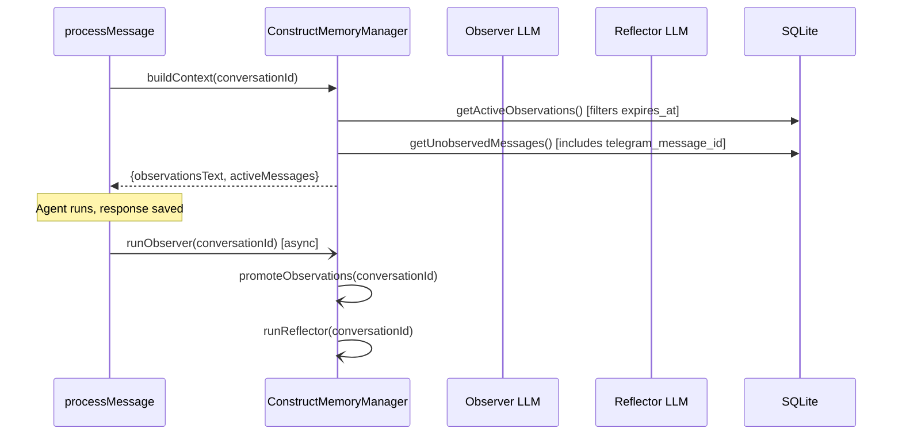

# Memory System

## Overview

Construct uses `@repo/cairn` for its memory pipeline. The core observe-reflect-promote-graph pipeline is documented in the [Cairn package docs](/cairn/). This page covers Construct-specific customizations.

## ConstructMemoryManager (`src/memory.ts`)

Construct subclasses Cairn's `MemoryManager` as `ConstructMemoryManager` to add:

### Custom Observer/Reflector Prompts

`CONSTRUCT_OBSERVER_PROMPT` and `CONSTRUCT_REFLECTOR_PROMPT` extend the defaults with Construct-specific guidance:

- **expires_at support** -- The observer can tag observations with an `expires_at` datetime for time-bound items (reminders, deadlines). Expired observations are filtered out of context.
- **Conversation style** -- Tuned for personal companion interactions rather than generic message compression.

### expires_at on Observations

When the observer detects time-bound content (e.g., "dentist appointment on March 5th"), it can set `expires_at` on the observation. The overridden `getActiveObservations()` filters out expired observations, keeping the context window relevant.

Migration `010-observation-expires-at.ts` adds the `expires_at TEXT` column to the `observations` table.

### telegram_message_id Selection

The overridden `getUnobservedMessages()` selects `telegram_message_id` alongside standard message fields, so the observer can include Telegram message references in its output.

## Three Layers of Memory

### 1. Declarative Memory (tool-driven)

The agent stores and recalls facts via tools:

| Tool            | Description                                                                               |
| --------------- | ----------------------------------------------------------------------------------------- |
| `memory_store`  | Store a memory with content, category, tags. Triggers async embedding + graph extraction. |
| `memory_recall` | Hybrid search: FTS5 + embedding cosine similarity + LIKE fallback, with graph expansion.  |
| `memory_forget` | Soft-delete by ID or search for candidates.                                               |
| `memory_graph`  | Explore the knowledge graph: search nodes, explore connections, check connectivity.       |

Categories: `general` (default), `preference`, `fact`, `reminder`, `note`.

### 2. Graph Memory (automatic)

An entity-relationship graph extracted from stored memories by the worker LLM. Enables associative recall -- "what do I know about Alice?" surfaces memories about Bob if they're connected through the graph.

See [Cairn docs](/cairn/) for graph extraction details.

### 3. Observational Memory (automatic)

Conversation history is compressed into dated observations by the observer LLM, replacing raw message replay with a compact prefix. The reflector condenses observations when they grow too large. The promoter bridges high-value observations into long-term memories.

See [Cairn docs](/cairn/) for the full observer/reflector/promoter pipeline.

## Integration into processMessage()

### At Message Arrival

1. **ConstructMemoryManager instantiation** -- Created with the database, worker model config, and custom prompts.
2. **Context building** -- `buildContext()` returns observations (compressed prefix) + un-observed messages (active suffix). Falls back to last 20 raw messages if no observations exist.
3. **Declarative memory loading** -- 10 most recent memories + up to 5 semantically relevant (embedding similarity >= 0.4). Injected into context preamble.
4. **Tool context** -- The `memoryManager` instance is passed to `memory_store` for triggering graph extraction.

### After Response

5. **Observer + Reflector + Promoter** -- Fire-and-forget after the response is saved. Benefits the next turn, not the current one.

## Embeddings

Embeddings are generated via OpenRouter's embeddings API. The default model is `qwen/qwen3-embedding-4b` (configurable via `EMBEDDING_MODEL`).

Embeddings serve three purposes:

1. **Memory recall** -- Semantic search (cosine similarity threshold 0.4 in processMessage, 0.3 in recallMemories)
2. **Tool pack selection** -- Same query embedding reused
3. **Skill selection** -- Same query embedding reused

If embedding generation fails, the system degrades gracefully: FTS5 and keyword search still work.

## Configuration

| Variable              | Required | Default                   | Description                                                                                      |
| --------------------- | -------- | ------------------------- | ------------------------------------------------------------------------------------------------ |
| `MEMORY_WORKER_MODEL` | No       | _(none)_                  | Model for observer, reflector, graph extraction. If unset, LLM-powered memory features disabled. |
| `EMBEDDING_MODEL`     | No       | `qwen/qwen3-embedding-4b` | Model for embedding vectors.                                                                     |
| `OPENROUTER_API_KEY`  | Yes      | --                        | Used for all API calls.                                                                          |
