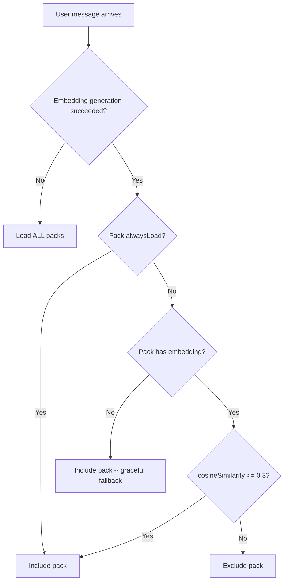

# Tool System

## Overview

Construct's tools are organized into **packs** -- logical groups of related tools. At message time, packs are selected based on embedding similarity to the user's message, so only relevant tools are sent to the LLM. This keeps the context window lean. The system supports both built-in packs (defined in source) and dynamic packs (loaded from the extensions directory at runtime).

## Key Files

| File | Role |
|------|------|
| `src/tools/packs.ts` | Pack definitions, embedding cache, selection logic, `InternalTool` and `ToolPack` types |
| `src/tools/core/` | Core pack: memory, schedule, secret, identity, usage tools |
| `src/tools/self/` | Self pack: source read/edit, test, deploy, logs, status, extension reload |
| `src/tools/web/` | Web pack: web page reading, web search |
| `src/tools/telegram/` | Telegram pack: react, reply-to, pin/unpin, get-pinned, ask |

## How Tools Are Defined

Every tool follows the `InternalTool<T>` interface:

```typescript
interface InternalTool<T extends TSchema> {
  name: string
  description: string
  parameters: T               // TypeBox JSON Schema
  execute: (
    toolCallId: string,
    args: unknown,
  ) => Promise<{ output: string; details?: unknown }>
}
```

Tools are created by **factory functions** that receive a `ToolContext`:

```typescript
interface ToolContext {
  db: Kysely<Database>        // Database connection
  chatId: string              // Current chat identifier
  apiKey: string              // OpenRouter API key
  projectRoot: string         // Absolute path to project root
  dbPath: string              // Path to SQLite database file
  timezone: string            // User's configured timezone
  tavilyApiKey?: string       // Tavily API key (for web search)
  logFile?: string            // Path to log file
  isDev: boolean              // Development mode flag
  extensionsDir?: string      // Extensions directory path
  telegram?: TelegramContext  // Telegram bot + chat context (absent in CLI)
  memoryManager?: MemoryManager // Cairn memory manager instance
  embeddingModel?: string     // Embedding model override
}
```

A factory returns `InternalTool | null`. Returning `null` means the tool should not be loaded (e.g., `self_deploy` is null in dev mode, `web_search` is null without a Tavily key, telegram tools are null outside Telegram context).

## Tool Packs

A pack groups related tool factories under a name and description:

```typescript
interface ToolPack {
  name: string
  description: string
  alwaysLoad: boolean         // If true, skip embedding similarity check
  factories: ToolFactory[]    // Functions that create tools from ToolContext
}
```

### Built-in Packs

| Pack | `alwaysLoad` | Tools | Description |
|------|:---:|-------|-------------|
| **core** | Yes | `memory_store`, `memory_recall`, `memory_forget`, `memory_graph`, `schedule_create`, `schedule_list`, `schedule_cancel`, `secret_store`, `secret_list`, `secret_delete`, `usage_stats`, `identity_read`, `identity_update` | Long-term memory, scheduling, secrets, identity management |
| **web** | No | `web_read`, `web_search` | Read web pages (via Jina Reader), search the web (via Tavily) |
| **self** | No | `self_read_source`, `self_edit_source`, `self_run_tests`, `self_view_logs`, `self_deploy`, `self_system_status`, `extension_reload` | Self-modification, diagnostics, deployment |
| **telegram** | Yes | `telegram_react`, `telegram_reply_to`, `telegram_pin`, `telegram_unpin`, `telegram_get_pinned`, `telegram_ask` | Telegram-specific message interactions |

### Pack Selection Algorithm



At startup, `initPackEmbeddings()` generates embedding vectors for each non-`alwaysLoad` pack's description string. These are cached in a module-level `Map<string, number[]>`.

At message time, `selectPacks()` compares the user message embedding against pack embeddings. Packs with cosine similarity >= 0.3 (the default threshold) are included. The function is pure and testable -- it accepts packs and embeddings as parameters.

`selectAndCreateTools()` combines selection with instantiation: it selects packs, then calls each factory with the `ToolContext`, filtering out null results.

## Individual Tool Details

### Core Pack (always loaded)

**memory_store** -- Stores a memory with optional category and tags. Generates an embedding in the background (non-blocking) for future semantic search.

**memory_recall** -- Searches memories using a three-tier hybrid approach:
1. FTS5 full-text search on the `memories_fts` virtual table
2. Embedding cosine similarity (threshold 0.3) against all memories with embeddings
3. LIKE keyword fallback
Results are merged and deduplicated.

**memory_forget** -- Soft-deletes (archives) a memory by ID, or searches for candidates if given a query.

**memory_graph** -- Explores the knowledge graph with three actions: `search` (find nodes by name), `explore` (show connections from a node), `connect` (check if two concepts are linked).

**schedule_create** -- Creates a one-shot (`run_at`) or recurring (`cron_expression`) schedule. Takes a single `instruction` parameter describing what the agent should do when the schedule fires. All schedules run through the full agent pipeline with tool access. Includes two-pass dedup (Levenshtein + embedding similarity). The `chat_id` is injected automatically. See [Scheduler](/construct/scheduler/).

**schedule_list** -- Lists all active (or all) schedules.

**schedule_cancel** -- Deactivates a schedule by ID.

**secret_store / secret_list / secret_delete** -- Manage secrets in the `secrets` table. Values are never exposed through `secret_list`. Secrets are available to dynamic extension tools.

**usage_stats** -- Returns AI usage statistics (cost, tokens, message count) with optional day range and source filter.

**identity_read / identity_update** -- Read and write identity files (SOUL.md, IDENTITY.md, USER.md). Updates invalidate the system prompt cache and trigger extension reload.

### Web Pack (similarity-selected)

**web_read** -- Fetches a URL through `r.jina.ai` (Jina Reader) which returns clean markdown. Truncates at 12,000 characters.

**web_search** -- Searches the web via the Tavily API. Requires `TAVILY_API_KEY`. Returns up to 5 results with titles, URLs, and content snippets. Includes an AI-generated summary when available.

### Self Pack (similarity-selected)

**self_read_source** -- Reads files within `src/`, `cli/`, `extensions/`, or config files (`package.json`, `tsconfig.json`, `CLAUDE.md`). The project root is scoped to the monorepo root. The `extensions/` prefix is resolved against `EXTENSIONS_DIR`.

**self_edit_source** -- Search-and-replace editing within `src/`, `cli/`, or `extensions/`. Includes rejection detection: if the user recently rejected a `telegram_ask` question, edits are blocked to prevent unwanted changes.

**self_run_tests** -- Runs `npx vitest run --reporter=verbose` with optional test name filter. 60-second timeout.

**self_view_logs** -- Reads from the log file (with optional `since` and `grep` filtering) or falls back to `journalctl` for the systemd service.

**self_deploy** -- Full deployment pipeline:
1. Typecheck (`tsc --noEmit`)
2. Test (`vitest run`)
3. Git tag backup (`pre-deploy-TIMESTAMP`)
4. Git add `src/` + `cli/`, commit
5. Restart systemd service
6. Health check (5-second delay then `systemctl is-active`)
7. Auto-rollback on failure (`git revert HEAD`, restart)

Rate-limited to 3 deploys per hour. Disabled in development mode.

**self_system_status** -- Reports CPU, RAM, disk, temperature, database size, log file size, and uptimes. Can also rotate (archive) the log file.

**extension_reload** -- Reloads all extensions from disk, invalidates the system prompt cache.

### Telegram Pack (always loaded)

All Telegram tools require a `TelegramContext` (so they return null from CLI).

**telegram_react** -- Adds an emoji reaction to the user's message. Can optionally suppress the text reply (the reaction IS the response). Uses a side-effects pattern -- the tool sets flags on `TelegramContext.sideEffects`.

**telegram_reply_to** -- Marks the response to be sent as a reply to a specific Telegram message ID.

**telegram_pin / telegram_unpin / telegram_get_pinned** -- Pin management. These call the Telegram Bot API directly.

**telegram_ask** -- Sends an interactive question to the user via Telegram (e.g., for confirmation before a destructive action). Creates a `pending_asks` row and sends the question as a Telegram message. The response is tracked when the user replies. Used by self-edit for rejection detection.

## TypeBox Schemas

Tool parameters use `@sinclair/typebox` for JSON Schema generation:

```typescript
import { Type, type Static } from '@sinclair/typebox'

const Params = Type.Object({
  query: Type.String({ description: 'Search query' }),
  limit: Type.Optional(Type.Number({ description: 'Max results' })),
})

type Input = Static<typeof Params>
```

TypeBox schemas are passed directly to pi-agent-core, which uses them for LLM function calling.

## Side-Effects Pattern (Telegram Tools)

Telegram tools like `telegram_react` and `telegram_reply_to` don't perform their actions immediately. Instead, they set flags on a mutable `TelegramSideEffects` object:

```typescript
interface TelegramSideEffects {
  reactToUser?: string        // Emoji to react with
  replyToMessageId?: number   // Message ID to reply to
  suppressText?: boolean      // Skip sending text reply
}
```

After the agent finishes, the Telegram bot handler reads these flags and executes the side effects. This avoids race conditions and lets the LLM combine a reaction with a text reply in a single turn.
