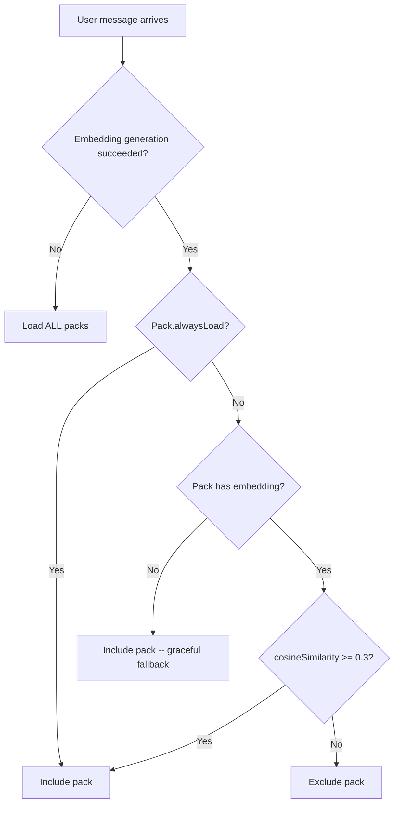

# Tool System

## Overview

Construct's tools are organized into **packs** -- logical groups of related tools. At message time, packs are selected based on embedding similarity to the user's message, so only relevant tools are sent to the LLM. This keeps the context window lean. The system supports both built-in packs (defined in source) and dynamic packs (loaded from the extensions directory at runtime).

## Key Files

| File                  | Role                                                                                    |
| --------------------- | --------------------------------------------------------------------------------------- |
| `src/tools/packs.ts`  | Pack definitions, embedding cache, selection logic, `InternalTool` and `ToolPack` types |
| `src/tools/core/`     | Core pack: memory, schedule, secret, identity, usage tools                              |
| `src/tools/self/`     | Self pack: source read/edit, test, deploy, logs, status, extension reload               |
| `src/tools/web/`      | Web pack: web page reading, web search                                                  |
| `src/tools/telegram/` | Telegram pack: react, reply-to, pin/unpin, get-pinned, ask                              |

## How Tools Are Defined

Every tool follows the `InternalTool<T>` interface:

```typescript
interface InternalTool<T extends TSchema> {
  name: string;
  description: string;
  parameters: T; // TypeBox JSON Schema
  execute: (toolCallId: string, args: unknown) => Promise<{ output: string; details?: unknown }>;
}
```

Tools are created by **factory functions** that receive a `ToolContext`:

```typescript
interface ToolContext {
  db: Kysely<Database>; // Database connection
  chatId: string; // Current chat identifier
  apiKey: string; // OpenRouter API key
  projectRoot: string; // Absolute path to project root
  dbPath: string; // Path to SQLite database file
  timezone: string; // User's configured timezone
  tavilyApiKey?: string; // Tavily API key (for web search)
  logFile?: string; // Path to log file
  isDev: boolean; // Development mode flag
  extensionsDir?: string; // Extensions directory path
  telegram?: TelegramContext; // Telegram bot + chat context (absent in CLI)
  memoryManager?: MemoryManager; // Cairn memory manager instance
  embeddingModel?: string; // Embedding model override
}
```

A factory returns `InternalTool | null`. Returning `null` means the tool should not be loaded (e.g., `web` tool is null without a Tavily key, telegram tools are null outside Telegram context).

## Tool Packs

A pack groups related tool factories under a name and description:

```typescript
interface ToolPack {
  name: string;
  description: string;
  alwaysLoad: boolean; // If true, skip embedding similarity check
  factories: ToolFactory[]; // Functions that create tools from ToolContext
}
```

### Built-in Packs

| Pack         | `alwaysLoad` | Tools                                                   | Description                                                             |
| ------------ | :----------: | ------------------------------------------------------- | ----------------------------------------------------------------------- |
| **core**     |     Yes      | `memory`, `schedule`, `secret`, `edit`, `read`, `shell` | Long-term memory, scheduling, secrets, file editing, reading, OS access |
| **web**      |      No      | `web`                                                   | Read web pages (via Jina Reader), search the web (via Tavily)           |
| **self**     |      No      | `skill`                                                 | Skill management, diagnostics                                           |
| **telegram** |     Yes      | `telegram`                                              | Telegram-specific message interactions                                  |

### Pack Selection Algorithm



At startup, `initPackEmbeddings()` generates embedding vectors for each non-`alwaysLoad` pack's description string. These are cached in a module-level `Map<string, number[]>`.

At message time, `selectPacks()` compares the user message embedding against pack embeddings. Packs with cosine similarity >= 0.3 (the default threshold) are included. The function is pure and testable -- it accepts packs and embeddings as parameters.

`selectAndCreateTools()` combines selection with instantiation: it selects packs, then calls each factory with the `ToolContext`, filtering out null results.

## Individual Tool Details

### Core Pack (always loaded)

**memory** -- Unified memory tool. Actions:

- `store` -- Stores a memory with optional category and tags. Generates an embedding in the background (non-blocking) for future semantic search.
- `recall` -- Searches memories using a three-tier hybrid approach: FTS5 full-text search, embedding cosine similarity (threshold 0.3), LIKE keyword fallback. Results are merged and deduplicated.
- `forget` -- Soft-deletes (archives) a memory by ID, or searches for candidates if given a query.
- `graph` -- Explores the knowledge graph with three actions: `search` (find nodes by name), `explore` (show connections from a node), `connect` (check if two concepts are linked).
- `stats` -- Returns AI usage statistics (cost, tokens, message count).
- `health` -- Shows pipeline queue and memory health.

**schedule** -- Unified schedule tool. Actions:

- `create` -- Creates a one-shot (`run_at`) or recurring (`cron_expression`) schedule. Takes a single `instruction` parameter describing what the agent should do when the schedule fires. Includes two-pass dedup (Levenshtein + embedding similarity). The `chat_id` is injected automatically. See [Scheduler](/construct/scheduler/).
- `list` -- Lists all active (or all) schedules.
- `cancel` -- Deactivates a schedule by ID.

**secret** -- Manage secrets in the `secrets` table. Actions:

- `store` -- Save a secret key-value pair.
- `list` -- Returns only key names and sources -- **never values**.
- `delete` -- Removes a secret.

**edit** -- Edit source files or identity documents. Actions:

- `source` -- Search-and-replace editing within `src/`, `cli/`, or `extensions/`. Includes rejection detection.
- `identity` -- Update personality files (SOUL.md, IDENTITY.md, USER.md). Updates invalidate the system prompt cache.

**read** -- Read files, list directories, or view identity documents. Actions:

- `file` -- Read a source file.
- `directory` -- List directory contents.
- `identity` -- Read SOUL.md, IDENTITY.md, or USER.md.

**shell** -- Execute shell commands. Passed to `/bin/sh -c`, so pipes, redirects, and chaining work.

### Web Pack (similarity-selected)

**web** -- Unified web tool. Actions:

- `read` -- Fetches a URL through `r.jina.ai` (Jina Reader) which returns clean markdown. Truncates at 12,000 characters.
- `search` -- Searches the web via the Tavily API. Requires `TAVILY_API_KEY`. Returns up to 5 results with titles, URLs, and content snippets. Includes an AI-generated summary when available.

### Self Pack (similarity-selected)

**skill** -- Unified skill management tool. Actions:

- `create` -- Create a new skill from a description and body.
- `update` -- Update a skill's body or description.
- `list` -- List all skills.
- `delete` -- Deprecate a skill.
- `inspect` -- Show skill details.
- `feedback` -- Record execution feedback on a skill.
- `conflicts` -- Detect contradictions between skills.

### Telegram Pack (always loaded)

All Telegram tools require a `TelegramContext` (so they return null from CLI).

**telegram** -- Unified Telegram tool. Actions:

- `react` -- Adds an emoji reaction to the user's message. Can optionally suppress the text reply.
- `reply` -- Marks the response to be sent as a reply to a specific Telegram message ID.
- `pin` / `unpin` / `get_pinned` -- Pin management. These call the Telegram Bot API directly.
- `ask` -- Sends an interactive question to the user via Telegram (e.g., for confirmation before a destructive action). Creates a `pending_asks` row and sends the question as a Telegram message.

## TypeBox Schemas

Tool parameters use `@sinclair/typebox` for JSON Schema generation:

```typescript
import { Type, type Static } from "@sinclair/typebox";

const Params = Type.Object({
  query: Type.String({ description: "Search query" }),
  limit: Type.Optional(Type.Number({ description: "Max results" })),
});

type Input = Static<typeof Params>;
```

TypeBox schemas are passed directly to pi-agent-core, which uses them for LLM function calling.

## Side-Effects Pattern (Telegram Tools)

Telegram tool actions like `react` and `reply` don't perform their actions immediately. Instead, they set flags on a mutable `TelegramSideEffects` object:

```typescript
interface TelegramSideEffects {
  reactToUser?: string; // Emoji to react with
  replyToMessageId?: number; // Message ID to reply to
  suppressText?: boolean; // Skip sending text reply
}
```

After the agent finishes, the Telegram bot handler reads these flags and executes the side effects. This avoids race conditions and lets the LLM combine a reaction with a text reply in a single turn.
